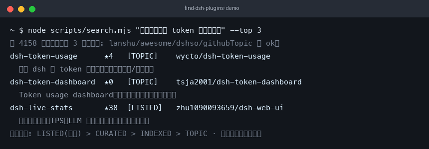

# find-dsh-plugins

[](https://awesome-dsh-plugin.com)
[](LICENSE)
[](https://github.com/JazzuLu/find-dsh-plugins)

中文 | [English](README.en.md)

**A conversational plugin finder for DeepSeek Harness — semantic search × four-source aggregation × security audit.**

Ask "is there a plugin that tracks token usage?", and the agent searches a unified
four-source index, semantically ranks the results, returns a candidate table with
security markers, then installs safely and verifies the mount.



## Table of Contents

1. [What makes it different](#what-makes-it-different)
2. [Supported agents](#supported-agents)
3. [Quick start](#quick-start)
4. [Usage example](#usage-example)
5. [How it works](#how-it-works)
6. [Compatibility](#compatibility)
7. [Data sources & freshness](#data-sources--freshness)
8. [Data sources & credits](#data-sources--credits)
9. [Security model](#security-model)
10. [FAQ](#faq)
11. [Development & contributing](#development--contributing)
12. [License](#license)

## What makes it different

| Capability | find-dsh-plugins (this repo) | dsh-find-plugins | dsh-find-plugin | dsh-plugin-finder |
|---|---|---|---|---|
| Retrieval | BM25 pre-filter + LLM semantic ranking | keyword match | keyword + star re-rank | single-registry match |
| Data sources | four-source aggregate (lanshu / awesome / dsh.so / GitHub topic) | GitHub topic only | 2 sources | dsh.so only |
| Security audit | evidence grades + local static audit | none | none | none |
| Form factor | skill, no restart | skill | plugin, restart needed | plugin, restart needed |
| Freshness | layered TTL + refresh on query | re-fetch each time | 5-min cache | - |

## Supported agents

Built on the open Agent Skills (`SKILL.md`) standard — the same skill body loads
in any compatible agent:

| Agent | Install | Notes |
| --- | --- | --- |
| skills.sh ecosystem (Claude Code / Cursor / Codex, etc.) | `npx skills add JazzuLu/find-dsh-plugins` | Standard `SKILL.md`, natively supported by skills.sh |
| DeepSeek Harness (dsh) | copy to `~/.dsh/skills/`, or `dsh plugin add github:JazzuLu/find-dsh-plugins` | dsh skill-filesystem scans the directory; watcher loads it instantly |
| Other Agent Skills-compliant agents | drop into each agent's skills directory | Same `SKILL.md` works as-is |

## Quick start

### Option 1: Skills CLI (recommended, all agents)

```sh
# Project-level
npx skills add JazzuLu/find-dsh-plugins

# Or global (all projects for the current user)
npx skills add JazzuLu/find-dsh-plugins -g
```

### Option 2: Manual copy for DSH (no restart)

```sh
# 1. Copy the runtime skill directory (only what the agent needs)
mkdir -p ~/.dsh/skills/find-dsh-plugins
cp -r SKILL.md scripts references ~/.dsh/skills/find-dsh-plugins/

# 2. Start a new session (or wait for the watcher)
# 3. Just talk:
#    "Is there a plugin that tracks token usage?"
#    "Help me install an SSH remote ops panel"
#    "What fun UI-enhancement plugins exist?"
```

### Option 3: Bundle install (DSH, restart required)

```sh
dsh plugin --profile web add github:JazzuLu/find-dsh-plugins
dsh web   # restart to load
```

### Upgrade / Uninstall

```sh
# Upgrade (bundle): re-run the install command
dsh plugin --profile web add github:JazzuLu/find-dsh-plugins

# Uninstall (bundle): always use the package name, never a local path
dsh plugin --profile web remove find-dsh-plugins

# Uninstall (manual copy): delete the directory
rm -rf ~/.dsh/skills/find-dsh-plugins
```

## Usage example

```
You: Is there a plugin that tracks token usage?
AI:
Candidate 1: dsh-web-ui (collection)  ★1416  [LISTED]
  One-liner: DSH Web UI plugin & skin collection, includes live token stats
  Why it matches: you want token-usage tracking; the collection ships a
                 live-stats component and is curated by all four sources
  Install: dsh plugin --profile web add @linxin666/dsh-web-ui-all
```

## How it works

```
Four sources (lanshu / awesome / dsh.so / GitHub topic)
   → build-index.mjs unified index (layered TTL, refresh on query)
   → search.mjs BM25 pre-filter → top-30
   → agent LLM semantic ranking → candidate table (with security markers)
   → install-methods.md safe install → post-install verification
```

## Compatibility

- **Node.js ≥ 22**: scripts use built-in `fetch` and `node:test`, zero third-party dependencies.
- **Network**: needs access to the four data sources (lanshu / awesome-dsh-plugin / dsh.so / GitHub API).
- **DSH**: tested on the 0.1.x line (web profile); works with any `SKILL.md` loader.

## Data sources & freshness

| Source | Link | Notes |
|---|---|---|
| Lanshu DSH plugin hub | https://dsh.lanshuagent.com | 30-min auto scan, evidence grading |
| awesome-dsh-plugin | https://github.com/awesome-dsh-plugin/awesome-dsh-plugin | curated directory, bilingual descriptions |
| dsh.so | https://www.dsh.so | DeepSeek Harness developer hub, open data license |
| GitHub dsh-plugin topic | https://github.com/topics/dsh-plugin | full ecosystem |

Freshness: curated sources TTL 30 min, GitHub incremental 15 min, GitHub full daily;
stale layers refresh synchronously on query. Optional scheduled tasks:

```sh
# launchd/cron: refresh curated + incremental every hour
0 * * * *  cd <skill-dir> && node scripts/build-index.mjs --quiet

# daily full refresh
0 3 * * *  cd <skill-dir> && node scripts/build-index.mjs --refresh-full --quiet
```

## Data sources & credits

The index aggregates data from the following public sources; data copyright belongs
to each source, this skill only aggregates and searches:

- Lanshu DSH plugin hub (https://dsh.lanshuagent.com) — 30-min scan and the
  evidence-grading system;
- awesome-dsh-plugin (https://github.com/awesome-dsh-plugin/awesome-dsh-plugin) —
  community-curated directory with bilingual descriptions;
- dsh.so (https://www.dsh.so) — DeepSeek Harness developer hub, whose plugin
  index is open under a "Free to reuse with attribution" license — special thanks;
- GitHub dsh-plugin topic (https://github.com/topics/dsh-plugin).

## Security model

- Evidence grades: LISTED (lanshu curated) > CURATED (awesome curated) > INDEXED
  (dsh.so) > TOPIC (GitHub topic only).
- Local static audit: lifecycle scripts, writes outside `$HOME`, shell-config
  modification — run in real time only for the top-3 candidates before the user
  confirms (GitHub anonymous API rate-limit budget).
- Disclaimer: plugins are third-party code; installing means trusting them. This
  skill only surfaces signals, it is not an endorsement.

## FAQ

**Q: Why are results sometimes not the freshest?**
A: The index auto-refreshes on layered TTLs (curated 30 min / GitHub incremental
15 min / full daily); stale layers refresh synchronously on query — you get the
freshest state available at query time, never fresher than the sources themselves.

**Q: What if nothing matches?**
A: The skill retries once with synonyms first; if still empty, the ecosystem truly
lacks it — ask the agent to build one with make-dsh-plugin.

**Q: Does the security audit execute plugin code?**
A: No. The static audit reads package.json and README text only (lifecycle scripts,
write paths, shell-config keywords) — no dependencies installed, no code executed.

**Q: Do I need an API key or to pay?**
A: No. BM25 pre-filter runs locally for free; LLM re-ranking reuses the current
session's model with no external API calls.

**Q: How is this different from dsh-find-plugin / dsh-plugin-finder?**
A: See the [comparison table](#what-makes-it-different) — semantic search,
four-source aggregation, and security audit are the three core differences.

## Development & contributing

- Tests: `npm test` (node:test, zero dependencies).
- Scripts: build-index.mjs (index), search.mjs (retrieval), audit.mjs (audit).
- PRs welcome: fix source field mappings, add audit rules, tune BM25 weights.

## License

BSD-3-Clause. All code original, no upstream implementation inherited.
